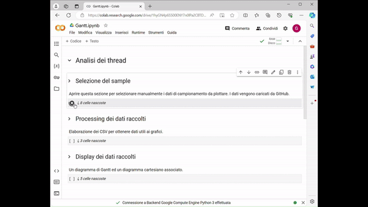

# Algoritmo 
Sviluppo algoritmo multi-thread con buffer di schedulazione per [ServeEasy](https://github.com/giorgio-hash/ServeEasy).
## Analisi prestazionali

Qui di seguito sono riportati dei link verso i Google Colab utilizzati per fare inferenza sulle simulazioni.
- Analisi schedulazione thread e rappresentazione Gantt disponibile [qui](https://colab.research.google.com/drive/1hyGN4p6SS00ENY7n0lPa2CBTDqbqRAC_?usp=sharing).
  
- Inferenza per verificare il requisito non funzionale delle performance sul tempo utile disponibile [qui](https://colab.research.google.com/drive/1PZyxKQf85-XFKB7PsUqYRUQSwh0I-cuO?usp=sharing).
  
